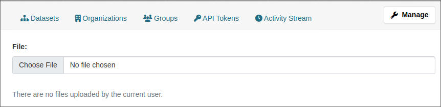
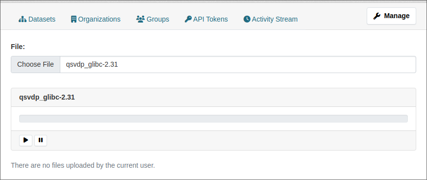
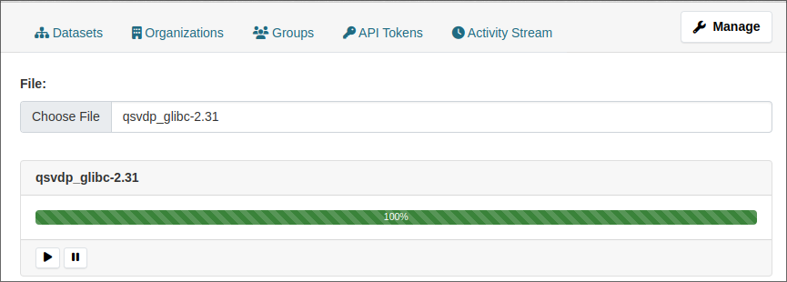
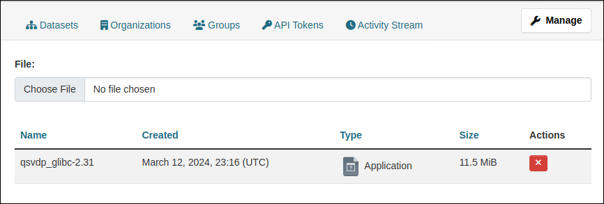

[](https://github.com/DataShades/ckanext-files/actions/workflows/test.yml)

# ckanext-files

Files as first-class citizens of CKAN. Upload, manage, remove files directly
and attach them to datasets, resources, etc.

## Requirements

Compatibility with core CKAN versions:

| CKAN version | Compatible? |
|--------------|-------------|
| 2.8          | yes         |
| 2.9          | yes         |
| 2.10         | yes         |
| master       | yes         |

CKAN v2.8 and v2.9 are supported by ckanext-files v0.2. Starting from v1.0 this
extension switches to CKAN support policy of two latest CKAN releases. I.e,
ckanext-files v1.0 supports only CKAN v2.10 and v2.11.

v0.2 will not receive any new features, only bug-fixes.

It's recommended to install the extension via pip, so you probably have all the
requirements pinned already. If you are using GitHub version of this extension,
stick to the vX.Y.Z tags to avoid breaking changes. Check the changelog before
upgrading the extension.

## Installation

To install ckanext-files:

1. Install the extension
   ```sh
   # minimal installation
   pip install ckanext-files

   # Google Cloud Storage support
   pip install 'ckanext-files[gcs]'
   ```

1. Add `files` to the `ckan.plugins` setting in your CKAN
   config file.

1. Run DB migrations
   ```sh
   # CKAN >= v2.9
   ckan db upgrade -p files

   # CKAN == v2.8
   paster --plugin=ckanext-files files -c ckan.ini initdb
   ```

## Usage

### Configure the storage

Before uploading any file, you have to configure a named **storage**. Tell
extension which driver to use(i.e, where and how data will be stored), add few
storage specific settings and you are ready to go. Let's start from the Redis
driver, because it has minimal requirements in terms of configuration.

Add the following line to the CKAN config file:

```ini
ckanext.files.storage.my_storage.type = files:redis
```

Look at this option. The prefix `ckanext.files.storage.` will be the same for
every configuration option related to storage. Then comes `my_storage`. It's a
name of your storage. It doesn't change the behavior of the storage, but
determines how options are grouped together and helps you to use multiple
storages simultaneously. For example the following configuration adds two
different storages:`first_storage` with `prefix` set to `first:` and
`second_storage` with prefix set to `second:`:

```ini
ckanext.files.storage.first_storage.type = files:redis
ckanext.files.storage.second_storage.type = files:redis

ckanext.files.storage.first_storage.prefix = first:
ckanext.files.storage.second_storage.prefix = second:
```

Our storage is called `my_storage` and after the storage's name comes option's
name `type`. And it's value `files:redis`. `type` option tells us which driver
we are going to use for the storage. `files:redis` is the name of the driver.

The recommended format of the driver name is
`<EXTENSION_NAME>:<STORAGE_TYPE>`. But this format is not enforced, so you can
see any value there. If you accidentally make a typo in the driver's name,
starting from v2.10 CKAN will show you an error message on startup with the
list of available drivers:

```sh
Invalid configuration values provided:
ckanext.files.storage.my_storage.type: Value must be one of ['files:bq_google_cloud_storage', 'files:fs', 'files:public_fs', 'files:redis', 'files:google_cloud_storage']
Aborted!
```

Storage is configured, so we can actually upload the file. Let's use
[ckanapi](https://github.com/ckan/ckanapi) for this task. Files are created via
`files_file_create` API action and this time we have to pass 3 parameters into it:

* `name`: the name of uploaded file
* `upload`: content of the file
* `storage`: name of the storage that stores the file(we just configured `my_storage`)

The final command is here:

```sh
ckanapi action files_file_create \
    name=hello.txt \
    upload='hello world' \
    storage=my_storage
```

And that's what you see as result:

```json
{
  "atime": null,
  "completed": true,
  "ctime": "2024-03-12T22:08:05.185914",
  "id": "7f9a7676-5177-40f0-b610-0b47918fdccc",
  "mtime": null,
  "name": "hello.txt",
  "storage": "my_storage",
  "storage_data": {
    "content_type": "text/plain",
    "filename": "2f51aeff-96a5-4d79-8973-7867527d7f2e",
    "hash": "5eb63bbbe01eeed093cb22bb8f5acdc3",
    "size": 11
  }
}
```

Now go to Redis CLI and check the content of the file. Note, you cannot get the
content via CKAN API, because it's JSON-based and downloading files doesn't
suit its principles.

By default, Redis driver puts the content under the key
`<PREFIX><FILENAME>`. Pay attention to `FILENAME`. It's the value available as
`storage_data.filename` in the API response(i.e,
`2f51aeff-96a5-4d79-8973-7867527d7f2e` in our case), not the name of the real
file you just uploaded.

`PREFIX` can be configured, but we skipped this step and got the default value: `ckanext:files:default:file_content:`. So the final Redis key of our file is `ckanext:files:default:file_content:2f51aeff-96a5-4d79-8973-7867527d7f2e`

```sh
redis-cli

127.0.0.1:6379> GET ckanext:files:default:file_content:2f51aeff-96a5-4d79-8973-7867527d7f2e
"hello world"

```

And before we moved further, let's remove the file, using ID we got when it was created:

```sh
ckanapi action files_file_delete id=7f9a7676-5177-40f0-b610-0b47918fdccc

# ... response from api

redis-cli

127.0.0.1:6379> GET ckanext:files:default:file_content:2f51aeff-96a5-4d79-8973-7867527d7f2e
(nil)

```

### Usage in code

If you are writing the code and you want to interact with the storage directly,
without the API layer, you can do it via a number of public functions of the
extension.

Let's configure filesystem storage first. This time we are going to use the
storage name `default`. This is "default" storage name - if you haven't
specified explicitely the name of the storage when working with it(calling API
actions, for example), `default` storage is used. So it's better to create this
storage instead of making fancy names.

Filesystem driver has a mandatory option `path` that controls path, where files
are stored. If path does not exist, storage will raise an exception by
default. But it can also create missing path if you enable `create_path`
option. Here's our final version of settings:

```ini
ckanext.files.storage.default.type = files:fs
ckanext.files.storage.default.path = /tmp/example
ckanext.files.storage.default.create_path = true
```

Now we are going to connect to CKAN shell via `ckan shell` CLI command and
create an instance of the storage:

```python
from ckanext.files.shared import get_storage
storage = get_storage('default')
```

Because you have all configuration in place, the rest is fairly
straightforward. We will upload the file, read it's content and remove it from
the CKAN shell.

Uploading is the most challenging step. As CKAN is based on Flask, we have to
upload files as Flask does. For it we are going to create an instance of `werkzeug.datastructures.FileStorage` and pass bytes stream to its constructor. After that, we can pass the object into storage's `upload` method and specify the name of the upload.

```python
from werkzeug.datastructures import FileStorage
from io import BytesIO

upload = FileStorage(BytesIO(b'hello world'))
result = storage.upload('file.txt', upload, {})

print(result)

... {'filename': 'd65da0fd-299a-433c-850e-086fdc5ebb7e',
...  'content_type': None,
...  'size': 11,
...  'hash': '5eb63bbbe01eeed093cb22bb8f5acdc3'}

```

`result` contains minimal amount of information that is required by storage to
manage the file. In case of FS storage, it includes `filename`. If you visit
`/tmp/example` directory, that we specified as a `path` for our storage, you'll
see there a file with the name matching `filename` from result. And its content
matches the content of our upload, which is quite an expected outcome.

But let's go back to the shell and try reading file from the python's
code. We'll pass `result` to the storage's `stream` method, which produces a
readable buffer based on our result. This buffer has `read` method so we can
work with the buffer just as we usually do with IO streams:

```python
buffer = storage.stream(result)
content = buffer.read()
print(content)

... b'hello world'
```

And finally we need to remove the file

```python
storage.remove(result)
```

### Usage in browser

You can upload files using JavaScript CKAN modules. The extension extends
CKAN's Sandbox object(available as `this.sandbox` inside the JS CKAN module),
so we can use shortcut and upload file directly from the DevTools. Open any
CKAN page, switch to JS console and create the sandbox instance. Inside it we
have `files` object, which in turn contains `upload` method. This method
accepts `File` object for upload(the same object you can get from the
`input[type=file]`).

```js
sandbox = ckan.sandbox()
await sandbox.files.upload(
  new File(["content"], "file.txt")
)

... {
...    "id": "d6fa3096-613a-4b16-a0eb-b7a6ec91d690",
...    "name": "file.txt",
...    "storage": "default",
...    "ctime": "2024-03-12T23:08:11.291971",
...    "mtime": null,
...    "atime": null,
...    "storage_data": {
...        "filename": "f484d116-cf6f-4238-80e5-905849873be0",
...        "content_type": "application/octet-stream",
...        "size": 7,
...        "hash": "9a0364b9e99bb480dd25e1f0284c8555"
...    },
...    "completed": true
... }
```

If you are still using FS storage configured in previous section, switch to
`/tmp/example` folder and check it's content:

```sh
ls /tmp/example
... f484d116-cf6f-4238-80e5-905849873be0

cat f484d116-cf6f-4238-80e5-905849873be0
... content
```

And, as usually, let's remove file using the ID from the `upload` promise:

```js
sandbox.client.call('POST', 'files_file_delete', {
  id: 'd6fa3096-613a-4b16-a0eb-b7a6ec91d690'
})
```

### UI

This extension provides a basic UI as an example and it's recommended to build
your own UI if you need it. But we can still use default functionality for
testing. Open the `/user/<YOUR USERNAME>/files` page of CKAN application in the
browser.



Choose the file



Click on play button(the one with triangle icon) and wait a bit. If nothing
changes, check JS console, it can show some errors when storage is not properly
configured.



When upload finished, reload the page to see uploaded file.



## Configuration

There are two types of config options for ckanext-files:
* Global configuration affects the common behavior of the extension
* Storage configuration changes behavior of the specific storage and never
  affects anything outside of the storage

Depending on the type of the storage, available options for storage change. For
example, `files:fs` storage type requires `path` option that controls
filesystem path where uploads are stored. `files:redis` storage type accepts
`prefix` option that defines Redis' key prefix of files stored in Redis. All
storage specific options always have form
`ckanext.files.storage.<STORAGE>.<OPTION>`:

```ini
ckanext.files.storage.memory.prefix = xxx:
# or
ckanext.files.storage.my_drive.path = /tmp/hello
```

Below is the list of non-storage specific options. Details of the specific
storage type can be found in the dedicated section of the storage type.

```ini

# Default storage used for upload when no explicit storage specified
# (optional, default: default)
ckanext.files.default_storage = default

# Configuration of the named storage.
# (optional, default: )
ckanext.files.storage.<NAME>.<OPTION> =

```

Starting from CKAN v2.10 you can check all available options for the storage
type via config declarations CLI. First, add the storage type to the config
file:

```ini
ckanext.files.storage.xxx.type = files:redis
```

Now run the command that shows all available config option of the
plugin.

```sh
ckan config declaration files -d
```

Because redis storage adapter is enabled, you'll see all the options
regsitered by redis driver alongside with the global options:


```ini
## ckanext-files ###############################################################
## ...
## Storage adapter used by the storage
ckanext.files.storage.xxx.type = files:redis
## The maximum size of a single upload.
## Supports size suffixes: 42B, 2M, 24KiB, 1GB. `0` means no restrictions.
ckanext.files.storage.xxx.max_size = 0
## Descriptive name of the storage used for debugging.
ckanext.files.storage.xxx.name = xxx
## Static prefix of the Redis key generated for every upload.
ckanext.files.storage.xxx.prefix = ckanext:files:default:file_content:
```

Sometimes you will see a validation error if storage has required config
options. Let's try using `files:fs` storage instead of the redis:

```ini
ckanext.files.storage.xxx.type = files:fs
```

Now attempt to run `ckan config declaration files -d` will show an error,
because required `path` option is missing:

```sh
Invalid configuration values provided:
ckanext.files.storage.xxx.path: Missing value
Aborted!
```

Add the required option to satisfy the application

```ini
ckanext.files.storage.xxx.type = files:fs
ckanext.files.storage.xxx.path = /tmp
```

And run CLI command once again. This time you'll see the list of allowed
options:

```ini
## ckanext-files ###############################################################
## ...
## Storage adapter used by the storage
ckanext.files.storage.xxx.type = files:fs
## The maximum size of a single upload.
## Supports size suffixes: 42B, 2M, 24KiB, 1GB. `0` means no restrictions.
ckanext.files.storage.xxx.max_size = 0
## Descriptive name of the storage used for debugging.
ckanext.files.storage.xxx.name = xxx
## Path to the folder where uploaded data will be stored.
ckanext.files.storage.xxx.path =
## Create storage folder if it does not exist.
ckanext.files.storage.xxx.create_path = false
```
