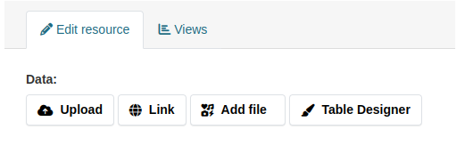
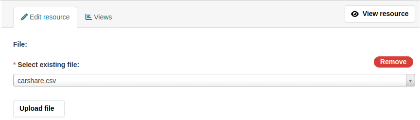

[](https://github.com/DataShades/ckanext-files/actions/workflows/test.yml)

# ckanext-files

Files as first-class citizens of CKAN. Upload, manage, remove files directly
and attach them to datasets, resources, etc.

## Requirements

Compatibility with core CKAN versions:

| CKAN version | Compatible? |
|--------------|-------------|
| 2.9          | no          |
| 2.10         | yes         |
| 2.11         | yes         |
| master       | yes         |


It's recommended to install the extension via pip. If you are using GitHub
version of the extension, stick to the vX.Y.Z tags to avoid breaking
changes. Check the [changelog](CHANGELOG.md) before upgrading the extension.

## Installation

To install ckanext-files:

1. Install the extension
   ```sh
   # minimal installation
   pip install ckanext-files
   ```

1. Add `files` to the `ckan.plugins` setting in your CKAN
   config file.

1. Run DB migrations
   ```sh
   ckan db upgrade -p files
   ```

## Usage

### Configure the storage

Before uploading files, you have to configure a **storage**: place where all
uploaded files are stored. Storage relies on **adapter** that describes where
and how data is be stored: filesystem, cloud, DB, etc. And, depending on the
adapter, storage may have a couple of addition specific options. For example,
filesystem adapter likely requires a path to the folder where uploads are
stored. DB adapter may need DB connection parameters. Cloud adapter most likely
will not work without an API key. These additional options are specific to
adapter and you have to check its documentation to find out what are the
possible options.

Let's start from the Redis adapter, because it has minimal requirements in terms
of configuration.

Add the following line to the CKAN config file:

```ini
ckanext.files.storage.default.type = files:redis
```

The name of adapter is `files:redis`. It follows recommended naming convention
for adapters:`<EXTENSION>:<TYPE>`. You can tell from the name above that we are
using adapter defined in the `files` extension with `redis` type. But this
naming convention is not enforced and its only purpose is avoiding name
conflicts. Technically, adapter name can use any character, including spaces,
newlines and emoji.


If you make a typo in the adapter's name, any CKAN CLI command will produce an
error message with the list of available adapters:

```sh
Invalid configuration values provided:
ckanext.files.storage.default.type: Value must be one of ['files:fs', 'files:public_fs', 'files:redis']
Aborted!
```

Storage is configured, so we can actually upload the file. Let's use
[ckanapi](https://github.com/ckan/ckanapi) for this task. Files are created via
`files_file_create` API action and this time we have to pass 2 parameters into
it:

* `name`: the name of uploaded file
* `upload`: content of the file

The final command is here:

```sh
echo -n 'hello world' > /tmp/myfile.txt
ckanapi action files_file_create name=hello.txt upload@/tmp/myfile.txt
```

And that's what you see as result:

```json
{
  "atime": null,
  "content_type": "text/plain",
  "ctime": "2024-06-02T15:02:14.819117+00:00",
  "hash": "5eb63bbbe01eeed093cb22bb8f5acdc3",
  "id": "e21162ab-abfb-476c-b8c5-5fe7cb89eca0",
  "location": "24d27fb9-a5f0-42f6-aaa3-7dcb599a0d46",
  "mtime": null,
  "name": "hello.txt",
  "size": 11,
  "storage": "default",
  "storage_data": {}
}
```

Content of the file can be checked via CKAN CLI. Use `id` from the last API
call's output in the command `ckan files stream ID`:

```sh
ckan files stream e21162ab-abfb-476c-b8c5-5fe7cb89eca0
```

Alternatively, we can use Redis CLI to get the content of the file. Note, you
cannot get the content via CKAN API, because it's JSON-based and streaming
files doesn't suit its principles.

By default, Redis adapter puts the content under the key
`<PREFIX><LOCATION>`. Pay attention to `LOCATION`. It's the value available as
`location` in the API response(i.e, `24d27fb9-a5f0-42f6-aaa3-7dcb599a0d46` in
our case). It's different from the `id`(ID used by DB to uniquely identify file
record) and `name`(human readable name of the file). In our scenario,
`location` looks like UUID because of the internal details of Redis adapter
implementation. But different adapters may use more path-like value,
i.e. something similar to `path/to/folder/hello.txt`.

`PREFIX` can be configured, but we skipped this step and got the default value:
`ckanext:files:default:file_content:`. So the final Redis key of our file is
`ckanext:files:default:file_content:24d27fb9-a5f0-42f6-aaa3-7dcb599a0d46`

```redis
redis-cli

127.0.0.1:6379> GET ckanext:files:default:file_content:24d27fb9-a5f0-42f6-aaa3-7dcb599a0d46
"hello world"
```

And before we moved further, let's remove the file, using its `id`:

```sh
ckanapi action files_file_delete id=e21162ab-abfb-476c-b8c5-5fe7cb89eca0
```

### Usage in code

If you are writing the code and you want to interact with the storage directly,
without the API layer, you can do it via a number of public functions of the
extension available in `ckanext.files.shared`.

Let's configure filesystem storage first. Filesystem adapter has a mandatory
option `path` that controls filesystem location, where files are stored. If
path does not exist, storage will raise an exception by default. But it can
also create missing path if you enable `create_path` option. Here's our final
version of settings:

```ini
ckanext.files.storage.default.type = files:fs
ckanext.files.storage.default.path = /tmp/example
ckanext.files.storage.default.create_path = true
```

Now we are going to connect to CKAN shell via `ckan shell` CLI command and
create an instance of the storage:

```python
from ckanext.files.shared import get_storage
storage = get_storage()
```

Because you have all configuration in place, the rest is fairly
straightforward. We will upload the file, read it's content and remove it from
the CKAN shell.

To create the file, `storage.upload` method must be called with 2 parameters:

* the human readable name of the file
* special steam-like object with content of the file

You can use any string as the first parameter. As for the "special stream-like
object", ckanext-files has `ckanext.files.shared.make_upload` function, that
accepts a number of different types(`bytes`,
`werkzeug.datastructures.FileStorage`, `BytesIO`, file descriptor) and converts
them into expected format.


```python
from ckanext.files.shared import make_upload

upload = make_upload(b"hello world")
result = storage.upload('file.txt', upload)

print(result)

... FileData(
...     location='60b385e7-8137-496c-bb1d-6ae4d7963ab3',
...     size=11,
...     content_type='text/plain',
...     hash='5eb63bbbe01eeed093cb22bb8f5acdc3',
...     storage_data={}
... )
```

`result` is an instance of `ckanext.files.shared.FileData` dataclass. It
contains all the information required by storage to manage the file.

`result` object has `location` attribute that contains the name of the file
*relative* to the `path` option specified in the storage configuration. If you
visit `/tmp/example` directory, which was set as a `path` for the storage,
you'll see there a file with the name matching `location` from result. And its
content matches the content of our upload, which is quite an expected outcome.

```sh
cat /tmp/example/60b385e7-8137-496c-bb1d-6ae4d7963ab3

... hello world
```

But let's go back to the shell and try reading file from the python's
code. We'll pass `result` to the storage's `stream` method, which produces an
iterable of bytes based on our result:

```python
buffer = storage.stream(result)
content = b"".join(buffer)

... b'hello world'
```

In most cases, storage only needs a location of the file object to read it. So,
if you don't have `result` generated during the upload, you still can read the
file as long as you have its location. But remember, that some storage adapters
may require additional information, and the following example must be adapted
depending on the adapter:

```python
from ckanext.files.shared import FileData

location = "60b385e7-8137-496c-bb1d-6ae4d7963ab3"
data = FileData(location)

buffer = storage.stream(data)
content = b"".join(buffer)
print(content)

... b'hello world'
```

And finally we can to remove the file

```python
storage.remove(result)
```

### Usage in browser

You can upload files using JavaScript CKAN modules. ckanext-files extends
CKAN's Sandbox object(available as `this.sandbox` inside the JS CKAN module),
so we can use shortcut and upload file directly from the DevTools. Open any
CKAN page, switch to JS console and create the sandbox instance. Inside it we
have `files` object, which in turn contains `upload` method. This method
accepts `File` object for upload(the same object you can get from the
`input[type=file]`).

```js
sandbox = ckan.sandbox()
await sandbox.files.upload(
  new File(["content"], "file.txt", {type: "text/plain"})
)

... {
...     "id": "18cdaa65-5eed-4078-89a8-469b137627ce",
...     "name": "file.txt",
...     "location": "b53907c3-8434-4dee-9a9e-6c4d3055d200",
...     "content_type": "text/plain",
...     "size": 7,
...     "hash": "9a0364b9e99bb480dd25e1f0284c8555",
...     "storage": "default",
...     "ctime": "2024-06-02T16:12:27.902055+00:00",
...     "mtime": null,
...     "atime": null,
...     "storage_data": {}
... }
```

If you are still using FS storage configured in previous section, switch to
`/tmp/example` folder and check it's content:

```sh
ls /tmp/example
... b53907c3-8434-4dee-9a9e-6c4d3055d200

cat b53907c3-8434-4dee-9a9e-6c4d3055d200
... content
```

And, as usually, let's remove file using the ID from the `upload` promise:

```js
sandbox.client.call("POST", "files_file_delete", {
  id: "18cdaa65-5eed-4078-89a8-469b137627ce"
})
```

### Multi-storage

It's possible to configure multiple storages at once and specify which one you
want to use for the individual file upload. Up until now we used the following
storage options:

* `ckanext.files.storage.default.type`
* `ckanext.files.storage.default.path`
* `ckanext.files.storage.default.create_path`

All of them have a common prefix `ckanext.files.storage.default.` and it's a
key for using multiple storages simultaneously.

Every option of the storage follows the pattern:
`ckanext.files.storage.<STORAGE_NAME>.<OPTION>`. As all the options above
contain `default` on position of `<STORAGE_NAME>`, they are related to the
`default` storage.

If you want to configure a storage with the name `custom` change the
configuration of storage:

```ini
ckanext.files.storage.custom.type = files:fs
ckanext.files.storage.custom.path = /tmp/example
ckanext.files.storage.custom.create_path = true
```

And, if you want to use Redis-based storage named `memory` and filesystem-based
storage named `default`, use the following configuration:

```ini
ckanext.files.storage.memory.type = files:redis

ckanext.files.storage.default.type = files:fs
ckanext.files.storage.default.path = /tmp/example
ckanext.files.storage.default.create_path = true
```

The `default` storage is special. ckanext-files use it by default, as name
suggests. If you remove configuration for the `default` storage and try to
create a file, you'll see the following error:

```sh
echo 'hello world' > /tmp/myfile.txt
ckanapi action files_file_create name=hello.txt upload@/tmp/myfile.txt

... ckan.logic.ValidationError: None - {'storage': ['Storage default is not configured']}
```

Storage **default** is not configured. That's why we need `default`
configuration. But if you want to upload a file into a different storage or you
don't want to add the `default` storage at all, you can always specify
explicitly the name of the storage you are going to use.

When using API actions, add `storage` parameter to the call:

```sh
echo 'hello world' > /tmp/myfile.txt
ckanapi action files_file_create name=hello.txt upload@/tmp/myfile.txt storage=memory
```

When writing python code, pass storage name to `get_storage` function:
```python
storage = get_storage("memory")
```

When writing JS code, pass object `{uploaderParams: [{storage: "memory"}]}` to
`upload` function:

```js
const sandbox = ckan.sandbox()
const file = new File(["content"], "file.txt", {type: "text/plain"})
const options = {uploaderParams: [{storage: "memory"}]};

await sandbox.files.upload(file, options)
```

### Tracked and untracked files

There is a difference between creating files via action:

```python
tk.get_action("files_file_create")(
    {"ignore_auth": True},
    {"upload": "hello", "name": "hello.txt"}
)
```

and via direct call to `Storage.upload`:

```python
from ckanext.files.shared import get_storage, make_upload

storage = get_storage()
storage.upload("hello.txt", make_upload(b"hello"), {})
```

The former snippet creates a *tracked* file: file uploaded to the storage and
its details are saved to database.

The latter snippet creates an *untracked* file: file uploaded to the storage,
but its details are not saved anywhere.

Untracked files can be used to achieve specific goals. For example, imagine a
storage adapter that writes files to the specified ZIP archive. You can create
an interface, that initializes such storage for *an existing ZIP resource* and
uploads files into it. You don't need a separate record in DB for every
uploaded file, because all of them go into the resource, that is already stored
in DB.

But such use-cases are pretty specific, so prefer to use API if you are not
sure, what you need. The main reason to use tracked files is their
discoverability: you can use `files_file_search` API action to list all the
tracked files and optionally filter them by storage, location, content_type,
etc:

```sh
ckanapi action files_file_search

... {
...   "count": 123,
...   "results": [
...     {
...       "atime": null,
...       "content_type": "text/plain",
...       "ctime": "2024-06-02T14:53:12.345358+00:00",
...       "hash": "5eb63bbbe01eeed093cb22bb8f5acdc3",
...       "id": "67a0dc8f-be91-48cd-bc8a-9934e12a48d0",
...       "location": "25c01077-c2cf-484b-a417-f231bb6b448b",
...       "mtime": null,
...       "name": "hello.txt",
...       "size": 11,
...       "storage": "default",
...       "storage_data": {}
...     },
...     ...
...   ]
... }

ckanapi action files_file_search size:5 rows=1

... {
...   "count": 2,
...   "results": [
...     {
...       "atime": null,
...       "content_type": "text/plain",
...       "ctime": "2024-06-02T14:53:12.345358+00:00",
...       "hash": "5eb63bbbe01eeed093cb22bb8f5acdc3",
...       "id": "67a0dc8f-be91-48cd-bc8a-9934e12a48d0",
...       "location": "25c01077-c2cf-484b-a417-f231bb6b448b",
...       "mtime": null,
...       "name": "hello.txt",
...       "size": 5,
...       "storage": "default",
...       "storage_data": {}
...     }
...   ]
... }

ckanapi action files_file_search content_type=application/pdf

... {
...   "count": 0,
...   "results": []
... }
```

As for untracked files, their discoverability depends on the storage
adapters. Some of them, `files:fs` for example, can scan the storage and locate
all uploaded files, both thacked and untracked. If you have `files:fs` storage
configured as `default`, use the following command to scan its content:

```sh
ckan files scan
```

If you want to scan a different storage, specify its name via
`-s/--storage-name` option. Remember, that some storage adapters do not support
scanning.

```sh
ckan files scan -s memory
```

If you want to see untracked files only, add `-u/--untracked-only` flag.

```sh
ckan files scan -u
```

If you want to track any untracked files, by creating a DB record for every
such file, add `-t/--track` flag. After that you'll be able to discover
previously untracked files via `files_file_search` API action. Most usable this
option will be during the migration, when you are configuring a new storage,
that points to an existing location with files.

```sh
ckan files scan -t
```

### Permissions

File creation is not allowed by default. Only sysadmin can use
`files_file_create` and `files_multipart_start` actions. This is done
deliberately: uncontrolled uploads can turn your portal into user's personal
cloud-storage.

There are three ways to grant upload permission to normal users.

The BAD option is simple. Enable `ckanext.files.authenticated_uploads.allow`
config option and every registered user will be allowed to upload files. But
only into `default` storage. If you want to change the list of storages
available to common user, specify storage names as
`ckanext.files.authenticated_uploads.storages` option.

The GOOD option is relatively simple. Define chained auth function with name
`files_file_create`. It's called whenever user initiates an upload. Now you can
decide whether user is allowed to upload files with specified parameters.

The BEST option is to leave this restriction unchanged. Do not allow any user
to call `files_file_create`. Instead, create a new action for your
goal. ckanext-files isn't a solution - it's a tool that helps you in building
the solution.

If you need to add *documents* field to dataset that contains uploaded PDF
files, create a separate action `dataset_document_attach`. Specify access rules
and validation for it. Or even hardcode the storage that will be used for
uploads. And then, from this new action, call `files_file_create` with
`ignore_auth: True`.

In this way you control every side of uploading documents into dataset and do
not accidentally break other functionality, because every other feature will
define its own action.

### File ownership

Every file *can* have an owner and there can be only one owner of the
file. It's possible to create file without an owner, but usually application
will only benefit from keeping every file with its owner. Owner is described
with two fields: ID and type.

When file is created, by default the current user from API action's context is
assigned as an owner of the file. From now on, the owner can perform other
operations, such as renaming/displaying/removing with the file.

Apart from chaining auth function, to modify access rules for the file, plugin
can implement `IFiles.files_is_allowed` method.

```python
def files_is_allowed(
    self,
    context: Context,
    file: File | Multipart | None,
    operation: types.AuthOperation,
    next_owner: Any | None,
) -> bool | None:
    ...
```

This method receives current action context, the file that is accessed, the
name of operation(`show`, `update`, `delete`, `file_transfer`) and the next
owner in case of file transfer.

If method returns true/false, operation is allowed/denied. If method returns
`None`, default logic used to check access.

As already mentoined, by default, user who owns the file, can access it. But
what about different owners? What if file owned by other entity, like resource
or dataset?

Out of the box, nobody can access such files. But there are two config options
that modify this restriction. `ckanext.files.owner.cascade_access =
ENTITY_TYPE` gives access to file owned by entity if user already has access to
entity itself. Use words like `package`, `resource`, `group` instead of
`ENTITY_TYPE`.

For example: file is owned by *resource*. If cascade access is enabled, whoever
has access to `resource_show` of the *resource*, can also see the file owned by
this resource. If user passes `resource_update` for *resource*, he can also
modify the file owned by this resource, etc.

The second option is `ckanext.files.owner.transfer_as_update`. By default,
there is no auth function that gives user cascade permission to modify
ownership of the file. But when transfer-as-update enabled together with
cascade access, any user who has `resource_update`, can also modify ownership
of the file owned by *resource*.

Be careful and do not add `user` to
`ckanext.files.owner.cascade_access`. User's own files are considered private
and most likely you don't really need anyone else to be able to see or modify
these files.

### Ownership transfer

File ownership can be transfered. As there can be only one owner of the file,
as soon as you transfer ownership over file, you yourself do not own this file.

To transfer ownership, use `files_transfer_ownership` action and specify `id`
of the file, `owner_id` and `owner_type` of the new owner.

You can't just transfer ownership to anyone. You either must pass
`IFiles.files_is_allowed` check for `file_transfer` operation, or pass a
cascade access check for the future owner of the file when cascade access and
transfer-as-update is enabled.

For example, if you have the following options in config file:

```ini
ckanext.files.owner.cascade_access = organization
ckanext.files.owner.transfer_as_update = true
```
you must pass `organization_update` auth function if you want to transfer file
ownership to organization.

In addition, file can be *pinned*. In this way we mark important files. Imagine
the resource and its uploaded file. The link to this file is used by resource
and we don't want this file to be accidentally transfered to someone else. We
pin the file and now nobody can transfer the file without explicit confirmation
of his intention.

There are two ways to move pinned file:

* you can call `files_file_unpin` first and then transfer the ownership via
  separate API call
* you can pass `force` parameter to `files_transfer_ownership`

### Task queue

One of the challenges introduced by independently managed files is related to
file ownership. As long as you can call `files_transfer_ownership` manually,
things are transparent. But as soon as you add custom file field to dataset,
you probably want to automatically transfer ownership of the file refered by
this custom field.

Imagine, that you have PDF file owned by you. And you specify ID of this file
in the `attachment_id` field of the dataset. You want to show download link for
this file on the dataset page. But if file owned by you, nobody will be able to
download the file. So you decide to transfer file ownership to dataset, so that
anyone who sees dataset, can see the file as well.

You cannot update dataset and transfer ownership after it, because there will
be a time window between these two actions, when data is not valid. Or even
worse, after updating dataset you'll lose internet connection and won't be able
to finish the transfer.

Neither you can transfer ownership first and then update the
dataset. `attachment_id` may have additional validators and you don't know in
advance, whether you'll be able to successfully update dataset after the
transfer.

This problem can be solved via queuing additional *tasks* inside the
action. For example, validator that checks if certain file ID can be used as
`attachment_id` can queue ownership transfer. If dataset update completed
without errors, queued task is executed automatically and dataset becomes the
owner of the file.

Task is queued via `ckanext.files.shared.add_task` function, which accepts
objects inherited from `ckanext.files.shared.Task`. `Task` class requires
implementing abstract method `run(result: Any, idx: int, prev: Any)`, which is
called when task is executed. This method receives the result of action which
caused task execution, task's position in queue and the result of previous
task.

For example, one of `attachment_id` validatos can queue the following `MyTask`
via `add_task(MyTask(file_id))` to transfer `file_id` ownership to the updated
dataset:

```python
from ckanext.files.shared import Task

class MyTask(Task):
    def __init__(self, file_id):
        self.file_id = file_id

    def run(self, dataset, idx, prev):
        return tk.get_action("files_transfer_ownership")(
            {"ignore_auth": True},
            {
                "id": self.file_id,
                "owner_type": "package",
                "owner_id": dataset["id"],
                "pin": True,
            },
        )
```

As the first argument, `Task.run` receives the result of action which was
called. Right now only following actions support tasks:

* `package_create`
* `packaage_update`
* `resource_create`
* `resource_update`
* `group_create`
* `group_update`
* `organization_create`
* `organization_update`
* `user_create`
* `user_update`

If you want to enable tasks support for your custom action, decorate it with
`ckanext.files.shared.with_task_queue` decorator:

```python
from ckanext.files.shared import with_task_queue

@with_task_queue
def my_action(context, data_dict)
    # you can call `add_task` inside this action's stack frame.
    ...
```

Good example of validator using tasks is `files_transfer_ownership` validator
factory. It can be added to metadata schema as
`files_transfer_ownership(owner_type, name_of_id_field)`. For example, if you
are adding this validator to resource, call it as
`files_transfer_ownership("resource", "id")`. The second argument is the name
of the ID field. As in most cases it's `id`, you can omit the second argument:

* organization: `files_transfer_ownership("organization")`
* dataset: `files_transfer_ownership("package")`
* user: `files_transfer_ownership("user")`

### Capabilities

To understand in advance whether specific storage can perform certain actions,
ckanext-files uses `ckanext.files.shared.Capability`. It's an enumeration of
operations that can be supported by storage:

* CREATE: create a file as an atomic object
* STREAM: return file content as stream of bytes
* COPY: make a copy of the file inside the same storage
* REMOVE: remove file from the storage
* MULTIPART: create file in 3 stages: start, upload(repeatable), complete
* MOVE: move file to a different location inside the same storage
* EXISTS: check if file exists
* SCAN: iterate over all files in the storage
* APPEND: add content to the existing file
* COMPOSE: combine multiple files into a new one in the same storage
* RANGE: return specific range of bytes from the file
* ANALYZE: return file details from the storage, as if file was uploaded just now
* PERMANENT_LINK: make permanent download link for private file
* TEMPORAL_LINK: make expiring download link for private file
* ONE_TIME_LINK: make one-time download link for private file
* PUBLIC_LINK: make permanent public link

These capabilities are defined when storage is created and are automatically
checked by actions that work with storage. If you want to check if storage
supports certain capability, it can be done manually. If you want to check
presence of multiple capabilities at once, you can combine them via bitwise-or
operator.

```python
from ckanext.files.shared import Capability, get_storage

storage = get_storage()

can_read = storage.supports(Capability.STREAM)

read_and_write = Capability.CREATE | Capability.STREAM
can_read_and_write = storage.supports(read_and_write)

```

`ckan files storages -v` CLI command lists all configured storages with their
capabilities.

## File upload strategies

There is no "right" way to add file to entity via ckanext-files. Everything
depends on your use-case and here you can find a few different ways to combine
file and arbitrary entity.

### Attach existing file and then transfer ownership via API

The simplest option is just saving file ID inside a field of the entity. It's
recommended to transfer file ownership to the entity and pin the file.

```sh
ckanapi action package_patch id=PACKAGE_ID attachment_id=FILE_ID

ckanapi action files_transfer_ownership id=FILE_ID \
    owner_type=package owner_id=PACKAGE_ID pin=true
```

Pros:
* simple and transparent

Cons:
* it's easy to forget about ownership transfer and leave the entity with the
  inaccessible file
* after entity got reference to file and before ownership is transfered data
  may be considered invalid.

### Automatically transfer ownership using validator

Add `files_transfer_ownership(owner_type)` to the validation schema of
entity. When it validated, ownership transfer task is queued and file
automatically transfered to the entity after the update.

Pros:
* minimal amount of changes if metadata schema already modified
* relationships between owner and file are up-to-date after any modification

Cons:
* works only with files uploaded in advance and cannot handle native
  implementation of resource form

### Upload file and assign owner via queued task

Add a field that accepts uploaded file. The action itself does not process the
upload. Instead create a validator for the upload field, that will schedule a
task for file upload and ownership transfer.

In this way, if action is failed, no upload happens and you don't need to do
anything with the file, as it never left server's temporal directory. If action
finished without an error, the task is executed and file uploaded/attached to
action result.

Pros:
* can be used together with native group/user/resource form after small
  modification of CKAN core.
* handles upload inside other action as an atomic operation

Cons:
* you have to validate file before upload happens to prevent situation when
  action finished successfully but then upload failed because of file's content
  type or size.
* tasks themselves are experimental and it's not recommended to put a lot of
  logic into them
* there are just too many things that can go wrong

### Add a new action that combines uploads, modifications and ownership transfer

If you want to add attachmen to dataset, create a separate action that accepts
dataset ID and uploaded file. Internally it will upload the file by calling
`files_file_create`, then update dataset via `packaage_patch` and finally
transfer ownership via `files_transfer_ownership`.

Pros:
* no magic. Everything is described in the new action
* can be extracted into shared extension and used across multiple portals

Cons:
* if you need to upload multiple files and update multipe fields, action
  quickly becomes too compicated.
* integration with existing workflows, like dataset/resource creation is
  hard. You have to override existing views or create a brand new ones.

## Example implementation of custom storage adapter

Storage consist of the storage object that dispatches operation requests and 3
services that do the actual job: Reader, Uploader and Manager. To define a
custom storage, you need to extend the main storage class, describe storage
logic and register storage via `IFiles.files_get_storage_adapters`.

Let's implement DB storage. It will store files in SQL table using
SQLAlchemy. There will be just one requirement for the table: it must have
column for storing unique identifier of the file and another column for storing
content of the file as bytes.

For the sake of simplicity, our storage will work only with existing
tables. Create the table manually before we begin.

First of all, we create an adapter that does nothing and register it in our
plugin.

```python
from __future__ import annotations

from typing import Any
import sqlalchemy as sa

import ckan.plugins as p
from ckan.model.types import make_uuid
from ckanext.files import shared


class ExamplePlugin(p.SingletonPlugin):
    p.implements(shared.IFiles)
    def files_get_storage_adapters(self) -> dict[str, Any]:
        return {"example:db": DbStorage}


class DbStorage(shared.Storage):
    ...

```

After installing and enabling your custom plugin, you can configure storage
with this adapter by adding a single new line to config file:

```ini
ckanext.files.storage.db.type = files:db
```

But if you check storage via `ckan files storages -v`, you'll see that it can't
do anything.

```sh
ckan files storages -v

... db: example:db
...        Supports: Capability.NONE
...        Does not support: Capability.REMOVE|STREAM|CREATE|...

```


Before we start uploading files, let's make sure that storage has proper
configuration. As files will be stored in the DB table, we need the *name of
the table* and *DB connection string*. Let's assume that table already exists,
but we don't know which columns to use for files. So we need name of column for
content and for file's unique identifier. ckanext-files uses term `location`
instead of identifier, so we'll do the same in our implementation.

There are 4 required options in total:
* `db_url`: DB connection string
* `table`: name of the table
* `location_column`: name of column for file's unique identifier
* `content_column`: name of column for file's content

It's not mandatory, but is highly recommended that you declare config options
for the adapter. It can be done via `Storage.declare_config_options` class
method, which accepts `declaration` object and `key` namespace for storage
options.

```python
class DbStorage(shared.Storage):

    @classmethod
    def declare_config_options(cls, declaration, key) -> None:
        declaration.declare(key.db_url).required()
        declaration.declare(key.table).required()
        declaration.declare(key.location_column).required()
        declaration.declare(key.content_column).required()

```

And we probably want to initialize DB connection when storage is
initialized. For this we'll extend constructor, which must be defined as method
accepting keyword-only arguments:

```python
class DbStorage(shared.Storage):
    ...

    def __init__(self, **settings: Any) -> None:
        db_url = self.ensure_option(settings, "db_url")

        self.engine = sa.create_engine(db_url)
        self.location_column = sa.column(
            self.ensure_option(settings, "location_column")
        )
        self.content_column = sa.column(self.ensure_option(settings, "content_column"))
        self.table = sa.table(
            self.ensure_option(settings, "table"),
            self.location_column,
            self.content_column,
        )
        super().__init__(**settings)

```

You can notice that we are using `Storage.ensure_option` quite often. This
method returns the value of specified option from settings or raises an
exception.

The table definition and columns are saved as storage attributes, to simplify
building SQL queries in future.

Now we are going to define classes for all 3 storage services and tell storage,
how to initialize these services.

There are 3 services: Reader, Uploader and Manager. Each of them initialized
via corresponding storage method: `make_reader`, `make_uploader` and
`make_manager`. And each of them accepts a single argument during creation, the
storage itself.

```python
class DbStorage(shared.Storage):
    def make_reader(self):
        return DbReader(self)

    def make_uploader(self):
        return DbUploader(self)

    def make_manager(self):
        return DbManager(self)


class DbReader(shared.Reader):
    ...


class DbUploader(shared.Uploader):
    ...


class DbManager(shared.Manager):
    ...
```

Our first target is Uploader service. It's responsible for file creation. For
the minimal implementation it needs `upload` method and `capabilities`
attribute which tells the storage, what exactly the Uploader can do.

```python
class DbUploader(shared.Uploader):
    capabilities = shared.Capability.CREATE

    def upload(self, location: str, upload: shared.Upload, extras: dict[str, Any]) -> shared.FileData:
        ...
```

`upload` receives the `location`(name) of the uploaded file; `upload` object
with file's content; and `extras` dictionary that contains any additional
arguments that can be passed to uploader. We are going to ignore `location` and
generate a unique UUID for every uploaded file instead of using user-defined
filename.

The goal is to write the file into DB and return `shared.FileData` that
contains location of the file in DB(value of `location_column`), size of the
file in bytes, MIMEtype of the file and hash of file content.

For location we'll just use `ckan.model.types.make_uuid` function. Size and
MIMEtype are already available as `upload.size` and `upload.content_type`.

The only problem is hash of the content. You can compute it in any way you
like, but there is a simple option if you have no preferences. `upload` has
`hashing_reader` method, which returns an iterable for file content. When you
read file through it, content hash is automatically computed and you can get it
using `get_hash` method of the reader.

Just make sure to read the whole file before checking the hash, because hash
computed using consumed content. I.e, if you just create the hashing reader,
but do not read a single byte from it, you'll receive the has of empty
string. If you read just 1 byte, you'll receive the hash of this single byte,
etc.

The easiest option for you is to call `reader.read()` method to consume the
whole file and then call `reader.get_hash()` to receive the hash.

Here's the final implementation of DbUploader:

```python
class DbUploader(shared.Uploader):
    capabilities = shared.Capability.CREATE

    def upload(self, location: str, upload: shared.Upload, extras: dict[str, Any]) -> shared.FileData:
        uuid = make_uuid()
        reader = upload.hashing_reader()

        values = {
            self.storage.location_column: uuid,
            self.storage.content_column: reader.read(),
        }
        stmt = sa.insert(self.storage.table, values)

        result = self.storage.engine.execute(stmt)

        return shared.FileData(
            uuid,
            upload.size,
            upload.content_type,
            reader.get_hash()
        )
```

Now you can upload file into your new `db` storage:

```sh
ckanapi action files_file_create storage=db name=hello.txt upload@<(echo -n 'hello world')

...{
...  "atime": null,
...  "content_type": "text/plain",
...  "ctime": "2024-06-17T13:48:52.121755+00:00",
...  "hash": "5eb63bbbe01eeed093cb22bb8f5acdc3",
...  "id": "bdfc0268-d36d-4f1b-8a03-2f2aaa21de24",
...  "location": "5a4472b3-cf38-4c58-81a6-4d4acb7b170e",
...  "mtime": null,
...  "name": "hello.txt",
...  "owner_id": "59ea0f6c-5c2f-438d-9d2e-e045be9a2beb",
...  "owner_type": "user",
...  "pinned": false,
...  "size": 11,
...  "storage": "db",
...  "storage_data": {}
...}

```

File is created, but you cannot read it just yet. Try running `ckan files
stream` CLI command with file ID:

```sh
ckan files stream bdfc0268-d36d-4f1b-8a03-2f2aaa21de24

... Operation stream is not supported by db storage
... Aborted!

```

As expected, you have to write extra code.

Streaming, reading and generating links is a responsibility of Reader
service. We only need `stream` method for minimal implementation. This method
receives `shared.FileData` object(the same object as the one returned from
`Uploader.upload`) and `extras` containing all additional arguments passed by
the caller. The result is any iterable producing bytes.

We'll use `location` property of `shared.FileData` as a value for
`location_column` inside the table.

And don't forget to add `STREAM` capability to `Reader.capabilities`.

```python
class DbReader(shared.Reader):
    capabilities = shared.Capability.STREAM

    def stream(self, data: shared.FileData, extras: dict[str, Any]) -> Iterable[bytes]:
        stmt = (
            sa.select(self.storage.content_column)
            .select_from(self.storage.table)
            .where(self.storage.location_column == data.location)
        )
        row = self.storage.engine.execute(stmt).fetchone()

        return row

```

The result may be confusing: we returning Row object from the stream
method. But our goal is to return *any* iterable that produces bytes. Row is
iterable(tuple-like). And it contains only one item - value of column with file
content, i.e, bytes. So it satisfy the requirements.

Now you can check content via CLI once again.

```sh
ckan files stream bdfc0268-d36d-4f1b-8a03-2f2aaa21de24

... hello world
```

Finally, we need to add file removal for the minimal implementation. And it
also nice to to have `SCAN` capability, as it shows all files currently
available in storage, so we add it as bonus. These operations handled by
Manager. We need `remove` and `scan` methods. Arguments are already familiar to
you. As for results:

* `remove`: return `True` if file was successfully removed. Should return
  `False` if file does not exist, but it's allowed to return `True` as long as
  you are not checking the result.
* `scan`: return iterable with all file locations

```python
class DbManager(shared.Manager):
    storage: DbStorage
    capabilities = shared.Capability.SCAN | shared.Capability.REMOVE

    def scan(self, extras: dict[str, Any]) -> Iterable[str]:
        stmt = sa.select(self.storage.location_column).select_from(self.storage.table)
        for row in self.storage.engine.execute(stmt):
            yield row[0]

    def remove(
        self,
        data: shared.FileData | shared.MultipartData,
        extras: dict[str, Any],
    ) -> bool:
        stmt = sa.delete(self.storage.table).where(
            self.storage.location_column == data.location,
        )
        self.storage.engine.execute(stmt)
        return True
```

Now you can list the all the files in storage:
```sh
ckan files scan -s db
```

And remove file using ckanaapi and file ID

```sh
ckanapi action files_file_delete id=bdfc0268-d36d-4f1b-8a03-2f2aaa21de24
```

That's all you need for the basic storage. But check definition of base storage
and services to find details about other methods. And also check implementation
of other storages for additional ideas.

## CLI

ckanext-files register `files` entrypoint under `ckan` command. Commands below
must be executed as `ckan -c $CKAN_INI files <COMMAND>`.

`adapters [-v]`

List all available storage adapters. With `-v/--verbose` flag docstring from
adapter classes are printed as well.


`storages [-v]`

List all configured storages. With `-v/--verbose` flag all supported
capabilities are shown.

`stream FILE_ID`

Stream content of the file to STDOUT.

`scan [-s default] [-u] [-t [-a OWNER_ID]]`

List all files that exist in storage. Works only if storage supports `SCAN`. By
default shows content of `default` storage. `-s/--storage-name` option changes
target storage.

`-u/--untracked-only` flag shows only untracked files, that has no
corresponding record in DB. Can be used to identify leftovers after removing
data from portal.

`-t/--track` flag registers any untracked file by creating DB record for
it. Can be used only when `ANALYZE` is supported. Files are created without an
owner. Use `-a/--adopt-by` option with user ID to give ownership over new files
to the specified user. Can be used when configuring a new storage connected to
existing location with files.


## API actions

API actions are documented [here](docs/api.md)

## Public utilities

All public utilites are collected inside [`ckanext.files.shared`
module](docs/shared.md). Avoid using anything that is not listed there. Do not
import anything from modules other than `shared`.


## Interfaces

ckanext-files registers `ckanext.files.shared.IFiles` interface. As extension
is actively developed, this interface may change in future. Always use
`inherit=True` when implementing `IFiles`.

```python
class IFiles(Interface):
    """Extension point for ckanext-files."""

    def files_get_storage_adapters(self) -> dict[str, Any]:
        """Return mapping of storage type to adapter class.

        Example:
        >>> def files_get_storage_adapters(self):
        >>>     return {
        >>>         "my_ext:dropbox": DropboxStorage,
        >>>     }

        """

        return {}

    def files_register_owner_getters(self) -> dict[str, Callable[[str], Any]]:
        """Return mapping with lookup functions for owner types.

        Name of the getter is the name used as `Owner.owner_type`. The getter
        itself is a function that accepts owner ID and returns optional owner
        entity.

        Example:
        >>> def files_register_owner_getters(self):
        >>>     return {"resource": model.Resource.get}
        """
        return {}

    def files_is_allowed(
        self,
        context: Context,
        file: File | Multipart | None,
        operation: types.AuthOperation,
        next_owner: Any | None,
    ) -> bool | None:
        """Decide if user is allowed to perform specified operation on the file.

        Return True/False if user allowed/not allowed. Return `None` to rely on
        other plugins. If every implementation returns `None`, default logic
        allows only user who owns the file to perform any operation on it. It
        means, that nobody is allowed to do anything with file owner by
        resource, dataset, group, etc.

        Example:
        >>> def files_is_allowed(
        >>>         self, context, file, operation, next_owner
        >>> ) -> bool | None:
        >>>     if file.owner_info and file.owner_info.owner_type == "resource":
        >>>         return is_authorized_boolean(
        >>>             f"resource_{operation}",
        >>>             context,
        >>>             {"id": file.owner_info.id}
        >>>         )
        >>>
        >>>     return None

        """
        return None
```

## Validators


| Validator                                                    | Effect                                                                                                                                                               |
|--------------------------------------------------------------|----------------------------------------------------------------------------------------------------------------------------------------------------------------------|
| files_into_upload                                            | Transform value of field(usually file uploaded via `<input type="file">`) into upload object using `ckanext.files.shared.make_upload`                                |
| files_parse_filesize                                         | Convert human-readable filesize(1B, 10MiB, 20GB) into an integer                                                                                                     |
| files_ensure_name(name_field)                                | If `name_field` is empty, copy into it filename from current field. Current field must be processed with `files_into_upload` first                                   |
| files_file_id_exists                                         | Verify that file ID exists                                                                                                                                           |
| files_accept_file_with_type(*type)                           | Verify that file ID refers to file with one of specified types. As a type can be used full MIMEtype(`image/png`), or just its main(`image`) or secondary(`png`) part |
| files_accept_file_with_storage(*storage_name)                | Verify that file ID refers to file stored inside one of specified storages                                                                                           |
| files_transfer_ownership(owner_type, name_of_owner_id_field) | Transfer ownership for file ID to specified entity when current API action is successfully finished                                                                  |


## Configuration

There are two types of config options for ckanext-files:

* Global: affects the behavior of the extension and every available storage
  adapter.
* Storage configuration: changes behavior of the specific storage and never
  affects anything outside of the storage.

Depending on the type of the storage, available options are quite
different. For example, `files:fs` storage type requires `path` option that
controls filesystem path where uploads are stored. `files:redis` storage type
accepts `prefix` option that defines Redis' key prefix of files stored in
Redis. All storage specific options always have form
`ckanext.files.storage.<STORAGE>.<OPTION>`:

```ini
ckanext.files.storage.memory.prefix = xxx:
# or
ckanext.files.storage.my_drive.path = /tmp/hello
```


### Global configuration

```ini
# Default storage used for upload when no explicit storage specified
# (optional, default: default)
ckanext.files.default_storage = default

# MIMEtypes that can be served without content-disposition:attachment header.
# (optional, default: application/pdf image video)
ckanext.files.inline_content_types = application/pdf image video

# Storage used for user image uploads. When empty, user image uploads are not
# allowed.
# (optional, default: user_images)
ckanext.files.user_images_storage = user_images

# Storage used for group image uploads. When empty, group image uploads are
# not allowed.
# (optional, default: group_images)
ckanext.files.group_images_storage = group_images

# Storage used for resource uploads. When empty, resource uploads are not
# allowed.
# (optional, default: resources)
ckanext.files.resources_storage = resources

# Enable HTML templates and JS modules required for unsafe default
# implementation of resource uploads via files. IMPORTANT: this option exists
# to simplify migration and experiments with the extension. These templates
# may change a lot or even get removed in the public release of the
# extension.
# (optional, default: false)
ckanext.files.enable_resource_migration_template_patch = false

# Any authenticated user can upload files.
# (optional, default: false)
ckanext.files.authenticated_uploads.allow = false

# Names of storages that can by used by non-sysadmin users when authenticated
# uploads enabled
# (optional, default: default)
ckanext.files.authenticated_uploads.storages = default

# List of owner types that grant access on owned file to anyone who has
# access to the owner of file. For example, if this option has value
# `resource package`, anyone who passes `resource_show` auth, can see all
# files owned by resource; anyone who passes `package_show`, can see all
# files owned by package; anyone who passes
# `package_update`/`resource_update` can modify files owned by
# package/resource; anyone who passes `package_delete`/`resource_delete` can
# delete files owned by package/resoure. IMPORTANT: Do not add `user` to this
# list. Files may be temporarily owned by user during resource creation.
# Using cascade access rules with `user` exposes such temporal files to
# anyone who can read user's profile.
# (optional, default: package resource group organization)
ckanext.files.owner.cascade_access = package resource group organization

# Use `*_update` auth function to check cascade access for ownership
# transfer. Works with `ckanext.files.owner.cascade_access`, which by itself
# will check `*_file_transfer` auth function, but switch to `*_update` when
# this flag is enabled.
# (optional, default: true)
ckanext.files.owner.transfer_as_update = true
```

### Storage configuration

All available options for the storage type can be checked via config
declarations CLI. First, add the storage type to the config file:

```ini
ckanext.files.storage.xxx.type = files:redis
```

Now run the command that shows all available config option of the
plugin.

```sh
ckan config declaration files -d
```

Because Redis storage adapter is enabled, you'll see all the options
regsitered by Redis adapter alongside with the global options:

```ini
## ckanext-files ###############################################################
## ...
## Storage adapter used by the storage
ckanext.files.storage.xxx.type = files:redis
## Static prefix of the Redis key generated for every upload.
ckanext.files.storage.xxx.prefix = ckanext:files:default:file_content:
```

Sometimes you will see a validation error if storage has required config
options. Let's try using `files:fs` storage instead of the redis:

```ini
ckanext.files.storage.xxx.type = files:fs
```

Now any attempt to run `ckan config declaration files -d` will show an error,
because required `path` option is missing:

```sh
Invalid configuration values provided:
ckanext.files.storage.xxx.path: Missing value
Aborted!
```

Add the required option to satisfy the application

```ini
ckanext.files.storage.xxx.type = files:fs
ckanext.files.storage.xxx.path = /tmp
```

And run CLI command once again. This time you'll see the list of allowed
options:

```ini
## ckanext-files ###############################################################
## ...
## Storage adapter used by the storage
ckanext.files.storage.xxx.type = files:fs
## Path to the folder where uploaded data will be stored.
ckanext.files.storage.xxx.path =
## Create storage folder if it does not exist.
ckanext.files.storage.xxx.create_path = false
```

There is a number of options that are supported by every storage. You can set
them and expect that every storage, regardless of type, will use these options
in the same way:

```ini
## Storage adapter used by the storage
ckanext.files.storage.NAME.type = ADAPTER
## The maximum size of a single upload.
## Supports size suffixes: 42B, 2M, 24KiB, 1GB. `0` means no restrictions.
ckanext.files.storage.NAME.max_size = 0
## Space-separated list of MIME types or just type or subtype part.
## Example: text/csv pdf application video jpeg
ckanext.files.storage.NAME.supported_types =
## Allow using inefficient implemetation of MOVE/COPY/COMPOSE if size of the file is smaller than specified value.
ckanext.files.storage.default.inefficient_operation_cap = 10MiB
## Descriptive name of the storage used for debugging. When empty, name from
## the config option is used, i.e: `ckanext.files.storage.DEFAULT_NAME...`
ckanext.files.storage.NAME.name = NAME
```

#### Redis storage configuration

```ini
## Storage adapter used by the storage
ckanext.files.storage.NAME.type = files:redis
## Static prefix of the Redis key generated for every upload.
ckanext.files.storage.NAME.prefix = ckanext:files:default:file_content:
```

#### Filesystem storage configuration

Private filesystem storage

```ini
## Storage adapter used by the storage
ckanext.files.storage.NAME.type = files:fs
## Path to the folder where uploaded data will be stored.
ckanext.files.storage.NAME.path =
## Create storage folder if it does not exist.
ckanext.files.storage.NAME.create_path = false
## Use this flag if files can be stored inside subfolders
## of the main storage path.
ckanext.files.storage.NAME.recursive = false
```


Public filesystem storage

```ini
## Storage adapter used by the storage
ckanext.files.storage.NAME.type = files:public_fs
## Path to the folder where uploaded data will be stored.
ckanext.files.storage.NAME.path =
## Create storage folder if it does not exist.
ckanext.files.storage.NAME.create_path = false
## Use this flag if files can be stored inside subfolders
## of the main storage path.
ckanext.files.storage.NAME.recursive = false
## URL of the storage folder. `public_root + location` must produce a public URL
ckanext.files.storage.NAME.public_root =
```

#### OpenDAL storage configuration

To use this storage install extension with `opendal` extras.

```sh
pip install 'ckanext-files[opendal]'
```

The actual storage backend is controlled by `scheme` option of the
storage. List of all schemes is available
[here](https://docs.rs/opendal/latest/opendal/services/index.html)

```ini
## Storage adapter used by the storage
ckanext.files.storage.NAME.type = files:opendal
## OpenDAL service type. Check available services at  https://docs.rs/opendal/latest/opendal/services/index.html
ckanext.files.storage.NAME.scheme =
## JSON object with parameters passed directly to OpenDAL operator.
ckanext.files.storage.NAME.params =
```

#### Apache libcloud storage configuration

To use this storage install extension with `libcloud` extras.

```sh
pip install 'ckanext-files[libcloud]'
```

The actual storage backend is controlled by `provider` option of the
storage. List of all providers is available
[here](https://libcloud.readthedocs.io/en/stable/storage/supported_providers.html#provider-matrix)

```ini
## Storage adapter used by the storage
ckanext.files.storage.NAME.type = files:libcloud
## apache-libcloud storage provider. List of providers available at https://libcloud.readthedocs.io/en/stable/storage/supported_providers.html#provider-matrix . Use upper-cased value from Provider Constant column
ckanext.files.storage.NAME.provider =
## API key or username
ckanext.files.storage.NAME.key =
## Secret password
ckanext.files.storage.NAME.secret =
## JSON object with additional parameters passed directly to storage constructor.
ckanext.files.storage.NAME.params =
## Name of the container(bucket)
ckanext.files.storage.NAME.container =
```


## Migration from native CKAN storage system

Important: ckanext-files itself is an independent file-management system. You
don't have to migrate existing files from groups, users and resources to
it. You can just start using ckanext-files for **new fields** defined in
metadata schema or for uploading arbitrary files. And continue using native
CKAN uploads for group/user images and resource files. Migration workflows
described here merely exist as a PoC of using ckanext-files for everything in
CKAN. Don't migrate your production instances yet, because concepts and rules
may change in future and migration process will change as well. Try migration
only as an experiment, that gives you an idea of what else you want to see in
ckanext-file, and share this idea with us.

Note: every migration workflow described below requires installed
ckanext-files. Complete [installation](#installation) section before going
further.

CKAN has following types of files:

* group/organization images
* user avatars
* resource files
* site logo
* files uploaded via custom logic from extensions

At the moment, there is no migration strategy for the last two types. Replacing
site logo manually is a trivial task, so there will be no dedicated command for
it. As for extensions, every of them is unique, so feel free to create an issue
in the current repository: we'll consider creation of migration script for your
scenario or, at least, explain how you can perform migration by yourself.

Migration process for group/organization/user images and resource uploads
described below. Keep in mind, that this process only describes migration from
native CKAN storage system, that keeps files inside local filesystem. If you
are using storage extensions, like
[ckanext-s3filestore](https://github.com/okfn/ckanext-s3filestore) or
[ckanext-cloudstorage](https://github.com/TkTech/ckanext-cloudstorage), create
an issue in the current repository with a request of migration command. As
there are a lot of different forks of such extension, creating reliable
migration script may be challenging, so we need some details about your
environment to help with migration.

Migration workflows bellow require certain changes to metadata schemas, UI
widgets for file uploads and styles of your portal(depending on the
customization).

### Migration for group/organization images

Note: internally, groups and organizations are the same entity, so this
workflow describes both of them.

First of all, you need a configured storage that supports public links. As all
group/organization images are stored inside local filesystem, you can use
`files:public_fs` storage adapter.

This extension expects that the name of group images storage will be
`group_images`. This name will be used in all other commands of this migration
workflow. If you want to use different name for group images storage, override
`ckanext.files.group_images_storage` config option which has default value
`group_images` and don't forget to adapt commands if you use a different name
for the storage.

This configuration example sets 10MiB restriction on upload size via
`ckanext.files.storage.group_images.max_size` option. Feel free to change it or
remove completely to allow any upload size. This restriction is applied to
future uploads only. Any existing file that exceeds limit is kept.

Uploads restricted to `image/*` MIMEtype via
`ckanext.files.storage.group_images.supported_types` option. You can make this
option more or less restrictive. This restriction is applied to future uploads
only. Any existing file with wrong MIMEtype is kept.

`ckanext.files.storage.group_images.path` controls location of the upload
folder in filesystem. It should match value of `ckan.storage_path` option plus
`storage/uploads/group`. In example below we assume that value of
`ckan.storage_path` is `/var/storage/ckan`.

`ckanext.files.storage.group_images.public_root` option specifies base URL from
which every group image can be accessed. In most cases it's CKAN URL plus
`uploads/group`. If you are serving CKAN application from the `ckan.site_url`,
leave this option unchanged. If you are using `ckan.root_path`, like `/data/`,
insert this root path into the value of the option. Example below uses
`%(ckan.site_url)s` wildcard, which will be automatically replaced with the
value of `ckan.site_url` config option. You can specify site URL explicitely if
you don't like this wildcard syntax.

```ini
ckanext.files.storage.group_images.type = files:public_fs
ckanext.files.storage.group_images.max_size = 10MiB
ckanext.files.storage.group_images.supported_types = image
ckanext.files.storage.group_images.path = /var/storage/ckan/storage/uploads/group
ckanext.files.storage.group_images.public_root = %(ckan.site_url)s/uploads/group
```

Now let's run a command that show us the list of files available under newly
configured storage:

```sh
ckan files scan -s group_images
```

All these files are not tracked by files extension yet, i.e they don't have
corresponding record in DB with base details, like size, MIMEtype, filehash,
etc. Let's create these details via the command below. It's safe to run this
command multiple times: it will gather and store information about files not
registered in system and ignore any previously registered file.

```sh
ckan files scan -s group_images -t
```

Finally, let's run the command, that shows only untracked files. Ideally,
you'll see nothing upon executing it, because you just registered every file in
the system.

```ini
ckan files scan -s group_images -u
```

Note, all the file are still available inside storage directory. If previous
command shows nothing, it only means that CKAN already knows details about each
file from the storage directory. If you want to see the list of the files
again, omit `-u` flag(which stands for "untracked") and you'll see again all
the files in the command output:

```ini
ckan files scan -s group_images
```

Now, when all images are tracked by the system, we can give the ownership over
these files to groups/organizations that are using them. Run the command below
to connect files with their owners. It will search for groups/organizations
first and report, how many connections were identified. There will be
suggestion to show identified relationship and the list of files that have no
owner(if there are such files). Presence of files without owner usually means
that you removed group/organization from database, but did not remove its
image.

Finally, you'll be asked if you want to transfer ownership over files. This
operation does not change existing data and if you disable ckanext-files after
ownership transfer, you won't see any difference. The whole ownership transfer
is managed inside custom DB tables generated by ckanext-files, so it's safe
operation.

```sh
ckan files migrate groups group_images
```

Here's an example of output that you can see when running the command:

```sh
Found 3 files. Searching file owners...
[####################################] 100% Located owners for 2 files out of 3.

Show group IDs and corresponding file? [y/N]: y
d7186937-3080-429f-a434-22b74b9a8d39: file-1.png
87e2a1aa-7905-4a28-a087-90433f8e169e: file-2.png

Show files that do not belong to any group? [y/N]: y
file-3.png

Transfer file ownership to group identified in previous steps? [y/N]: y
Transfering file-2.png  [####################################]  100%
```

Now comes the most complex part. You need to change metadata schema and UI in
order to:

* make sure that all new files are uploaded and managed by ckanext-files
  instead of native CKAN's uploader
* generate image URLs using ckanext-files functionality. Right now, while files
  stored in the original storage folder it makes no difference. But if you
  change upload directory in future or even decide to move files from local
  filesystem into different storage backend, it will guarantee that files are
  remain visible.


Original CKAN workflow for uploading files was:

* just save image URL provided by user or
* upload a file
* put it into directory that is publicly served by application
* replace uploaded file in the HTML form/group metadata with the public URL of
  the uploaded file

This approach is different from strategy recommended by ckanext-files. But in
order to make the migration as simple as possible, we'll stay close to original
workflow.

Note: suggestet approach resembles existing process of file uploads in
CKAN. But ckanext-files was designed as a system, that gives you a
choice. Check [file upload strategies](#file-upload-strategies) to learn more
about alternative implementations of upload and their pros/cons.

First, we need to replace **Upload/Link** widget on group/organization form. If
you are using native group templates, create `group/snippets/group_form.html`
and `organization/snippets/organization_form.html`. Inside both files, extend
original template and override block `basic_fields`. You only need to replace last field

```jinja2
{{ form.image_upload(
    data, errors, is_upload_enabled=h.uploads_enabled(),
    is_url=is_url, is_upload=is_upload) }}
```

with

```jinja2
{{ form.image_upload(
    data, errors, is_upload_enabled=h.files_group_images_storage_is_configured(),
    is_url=is_url, is_upload=is_upload,
    field_upload="files_image_upload") }}
```

There are two differences with the original. First, we use
`h.files_group_images_storage_is_configured()` instead of
`h.uploads_enabled()`. As we are using different storage for different upload
types, now upload widgets can be enabled independently. And second, we pass
`field_upload="files_image_upload"` argument into macro. It will send uploaded
file to CKAN inside `files_image_upload` instead of original `image_upload`
field. This must be done because CKAN unconditionally strips `image_upload`
field from submission payload, making processing of the file too unreliable. We
changed the name of upload field and CKAN keeps this new field, so that we can
process it as we wish.

Note: if you are using ckanext-scheming, you only need to replace
`form_snippet` of the `image_url` field, instead of rewriting the whole
template.

Now, let's define validation rules for this new upload field. We need to create
plugins that modify validation schema for group and organization. Due to CKAN
implementation details, you need separate plugin for group and organization.

Note: if you are using ckanext-scheming, you can add `files_image_upload`
validators to schemas of organization and group. Check the list of validators
that must be applied to this new field below.

Here's an example of plugins that modify validation schemas of group and
organization. As you can see, they are mostly the same:

```python
from ckan.lib.plugins import DefaultGroupForm, DefaultOrganizationForm
from ckan.logic.schema import default_create_group_schema, default_update_group_schema


def _modify_schema(schema, type):
    schema["files_image_upload"] = [
        tk.get_validator("ignore_empty"),
        tk.get_validator("files_into_upload"),
        tk.get_validator("files_validate_with_storage")("group_images"),
        tk.get_validator("files_upload_as")(
            "group_images",
            type,
            "id",
            "public_url",
            type + "_patch",
            "image_url",
        ),
    ]


class FilesGroupPlugin(p.SingletonPlugin, DefaultGroupForm):
    p.implements(p.IGroupForm, inherit=True)
    is_organization = False

    def group_types(self):
        return ["group"]

    def create_group_schema(self):
        return _modify_schema(default_create_group_schema(), "group")

    def update_group_schema(self):
        return _modify_schema(default_update_group_schema(), "group")


class FilesOrganizationPlugin(p.SingletonPlugin, DefaultOrganizationForm):
    p.implements(p.IGroupForm, inherit=True)
    is_organization = True

    def group_types(self):
        return ["organization"]

    def create_group_schema(self):
        return _modify_schema(default_create_group_schema(), "organization")

    def update_group_schema(self):
        return _modify_schema(default_update_group_schema(), "organization")
```

There are 4 validators that must be applied to the new upload field:

* `ignore_empty`: to skip validation, when image URL set manually and no upload
  selected.
* `files_into_upload`: to convert value of upload field into normalized format,
  which is expected by ckanext-files
* `files_validate_with_storage(STORAGE_NAME)`: this validator requires an
  argument: the name of the storage we are using for image uploads. The
  validator will use storage settings to verify size and MIMEtype of the
  appload.
* `files_upload_as(STORAGE_NAME, GROUP_TYPE, NAME_OF_ID_FIELD, "public_url",
  NAME_OF_PATCH_ACTION, NAME_OF_URL_FIELF)`: this validator is the most
  challenging. It accepts 6 arguments:
  * the name of storage used for image uploads
  * `group` or `organization` depending on processed entity
  * name of the ID field of processed entity. It's `id` in your case.
  * `public_url` - use this exact value. It tells which property of file you
    want to use as link to the file.
  * `group_patch` or `organization_patch` depending on processed entity
  * `image_url` - name of the field that contains URL of the
    image. ckanext-files will put the public link of uploaded file into this
    field when form is processed.

That's all. Now every image upload for group/organization is handled by
ckanext-files. To verify it, do the following. First, check list of files
currently stored in `group_images` storage via command that we used in the
beginning of the migration:

```sh
ckan files scan -s group_images
```

You'll see a list of existing files. Their names follow format
`<ISO_8601_DATETIME><FILENAME>`, e.g `2024-06-14-133840.539670photo.jpg`.

Now upload an image into existing group, or create a new group with any
image. When you check list of files again, you'll see one new record. But this
time this record resembles UUID: `da046887-e76c-4a68-97cf-7477665710ff`.

### Migration for user avatars

This workflow is similar to group/organization migration. It contains the
sequence of actions, but explanations are removed, because you already know
details from the group migration. Only steps that are different will contain
detailed explanation of the process.


Configure local filesystem storage with support of public
links(`files:public_fs`) for user images.

This extension expects that the name of user images storage will be
`user_images`. This name will be used in all other commands of this migration
workflow. If you want to use different name for user images storage, override
`ckanext.files.user_images_storage` config option which has default value
`user_images` and don't forget to adapt commands if you use a different name
for the storage.

`ckanext.files.storage.user_images.path` resembles this option for
group/organization images storage. But user images are kept inside `user`
folder by default. As result, value of this option should match value of
`ckan.storage_path` option plus `storage/uploads/user`. In example below we
assume that value of `ckan.storage_path` is `/var/storage/ckan`.

`ckanext.files.storage.user_images.public_root` resebles this option for
group/organization images storage. But user images are available at CKAN URL
plus `uploads/user`.

```ini
ckanext.files.storage.user_images.type = files:public_fs
ckanext.files.storage.user_images.max_size = 10MiB
ckanext.files.storage.user_images.supported_types = image
ckanext.files.storage.user_images.path = /var/storage/ckan/storage/uploads/user
ckanext.files.storage.user_images.public_root = %(ckan.site_url)s/uploads/user
```

Check the list of untracked files available inside newly configured storage:

```sh
ckan files scan -s user_images -u
```

Track all these files:

```sh
ckan files scan -s user_images -t
```

Re-check that now you see no untracked files:

```ini
ckan files scan -s user_images -u
```

Transfer image ownership to corresponding users:

```sh
ckan files migrate users user_images
```

Update user template. Required field is defined in `user/new_user_form.html`
and `user/edit_user_form.html`. It's a bit different from the filed used by
group/organization, but you again need to add
`field_upload="files_image_upload"` parameter to the macro `image_upload` and
replace `h.uploads_enabled()` with `h.files_user_images_storage_is_configured()`.

User has no dedicated interface for validation schema modification and here
comes the biggest difference from group migration. You need to chain
`user_create` and `user_update` action and modify schema from `context`:


```python
def _patch_schema(schema):
    schema["files_image_upload"] = [
        tk.get_validator("ignore_empty"),
        tk.get_validator("files_into_upload"),
        tk.get_validator("files_validate_with_storage")("user_images"),
        tk.get_validator("files_upload_as")(
            "user_images",
            "user",
            "id",
            "public_url",
            "user_patch",
            "image_url",
        ),
    ]


@tk.chained_action
def user_update(next_action, context, data_dict):
    schema = context.setdefault('schema', ckan.logic.schema.default_update_user_schema())
    _patch_schema(schema)
    return next_action(context, data_dict)


@tk.chained_action
def user_create(next_action, context, data_dict):
    schema = context.setdefault('schema', ckan.logic.schema.default_user_schema())
    _patch_schema(schema)
    return next_action(context, data_dict)
```

Validators are all the same, but now we are using `user` instead of
`group`/`organization` in parameters.


That's all. Just as with groups, you can update an avatar and verify that all
new filenames resemble UUIDs.

### Migration for resource uploads

Configure named storage for resources. Use `files:ckan_resource_fs` storage
adapter.

This extension expects that the name of resources storage will be
`resources`. This name will be used in all other commands of this migration
workflow. If you want to use different name for resources storage, override
`ckanext.files.resources_storage` config option which has default value
`resources` and don't forget to adapt commands if you use a different name for
the storage.

`ckanext.files.storage.resources.path` must match value of `ckan.storage_path`
option, followed by `resources` directory. In example below we assume that
value of `ckan.storage_path` is `/var/storage/ckan`.

Example below sets 10MiB limit on resource size. Modify it if you are using
different limit set by `ckan.max_resource_size`.

Unlike group and user images, this storage does not need upload type
restriction and `public_root`.

```ini
ckanext.files.storage.resources.type = files:ckan_resource_fs
ckanext.files.storage.resources.max_size = 10MiB
ckanext.files.storage.resources.path = /var/storage/ckan/resources
```

Check the list of untracked files available inside newly configured storage:

```sh
ckan files scan -s resources -u
```

Track all these files:

```sh
ckan files scan -s resources -t
```

Re-check that now you see no untracked files:

```ini
ckan files scan -s resources -u
```

Transfer file ownership to corresponding resources. In addition to simple
ownership transfer, this command will ask you, whether you want to modify
resource's `url_type` and `url` fields. It's required to move file management
to files extension completely and enable possibility of migration to different
storage type.

If you accept resource modifications, for every file owner `url_type` will be
changed to `file` and `url` will be changed to file ID. Then all modified
packages will be reindexed.

Changing `url_type` means that some pages will change. For example, instead of
**Download** button CKAN will show you **Go to resource** button on the
resource page, because **Download** label is specific to `url_type=upload`. And
some views may stop working as well. But this is safer option for migration,
than leaving `url_type` unchanged: ckanext-files manages files in its own way
and some assumptions about files will not work anymore, so using different
`url_type` is the fastest way to tell everyone that something changed.

Broken views can be easily fixed. Every view implemented as a separate
plugin. You always can inherit from this plugin and override methods that
relied on different behavior. And a lot of views work with file URL directly,
so they won't even see the difference.

```sh
ckan files migrate local-resources resources
```

And the next goal is correct metadata schema. If you are using
[ckanext-scheming](https://github.com/ckan/ckanext-scheming), you need to
modify validators of `url` and `format` fields.

If you are working with native schemas, you have to modify dataset schema via
implementing IDatasetForm. Here's an example:


```python
from ckan.lib.plugins import DefaultDatasetForm
from ckan.logic import schema

class FilesDatasetPlugin(p.SingletonPlugin, DefaultDatasetForm):
    p.implements(p.IDatasetForm, inherit=True)

    def is_fallback(self):
        return True

    def package_types(self):
        return ["dataset"]

    def _modify_schema(self, schema):
        schema["resources"]["url"].extend([
            tk.get_validator("files_verify_url_type_and_value"),
            tk.get_validator("files_file_id_exists"),
            tk.get_validator("files_transfer_ownership")("resource","id"),
        ])
        schema["resources"]["format"].insert(0, tk.get_validator("files_content_type_from_file")("url"))

    def create_package_schema(self):
        sch = schema.default_create_package_schema()
        self._modify_schema(sch)
        return sch

    def update_package_schema(self):
        sch = schema.default_update_package_schema()
        self._modify_schema(sch)
        return sch

    def show_package_schema(self):
        sch = schema.default_show_package_schema()
        sch["resources"]["url"].extend([
            tk.get_validator("files_verify_url_type_and_value"),
            tk.get_validator("files_id_into_resource_download_url"),
        ])
        return sch

```

Both create and update schemas are updated in the same way. We add a new
validator to format field, to correctly identify file format. And there is a
number of new validators for `url`:

* `files_verify_url_type_and_value`: skip validation if we are not working with
  resource that contains file.
* `files_file_id_exists`: verify existence of file ID
* `files_transfer_ownership("resource","id")`: move file ownership to resource
  after successful validation

At top of this, we also have two validators applied to
`show_package_schema`(use `output_validators` in ckanext-scheming):

* `files_verify_url_type_and_value`: skip validation if we are not working with
  resource that contains file.
* `files_id_into_resource_download_url`: replace file ID with download URL in
  API output


And the next part is the trickiest. You need to create a number of templates
and JS modules. But because ckanext-files is actively developed, most likely,
your custom files will be outdated pretty soon.

Instead, we recommend enabling patch for resource form that shipped with
ckanext-files. It's a bit hacky, but because the extension itself is stil in
alpha-stage, it should be acceptable. Check [file upload
strategies](#file-upload-strategies) for examples of implementation that you
can add to your portal instead of the default patch.

To enable patch for templates, add following line to the config file:

```ini
ckanext.files.enable_resource_migration_template_patch = true
```

This option adds **Add file** button to resource form



Upon clicking, this button is replaced by widget that supports uploading new
files of selecting previously uploaded files that are not used by any resource
yet


