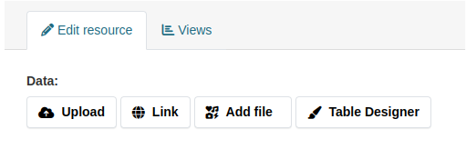
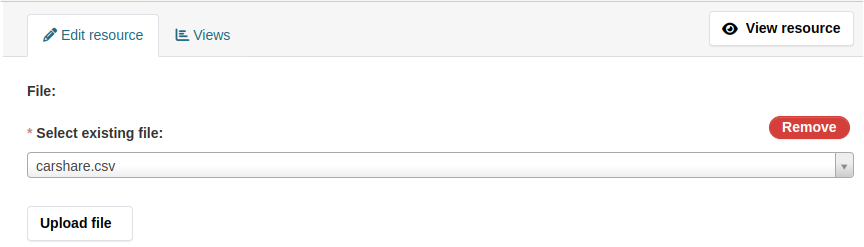

### Migration for resource uploads

Configure named storage for resources. Use `files:ckan_resource_fs` storage
adapter.

This extension expects that the name of resources storage will be
`resources`. This name will be used in all other commands of this migration
workflow. If you want to use different name for resources storage, override
`ckanext.files.resources_storage` config option which has default value
`resources` and don't forget to adapt commands if you use a different name for
the storage.

`ckanext.files.storage.resources.path` must match value of `ckan.storage_path`
option, followed by `resources` directory. In example below we assume that
value of `ckan.storage_path` is `/var/storage/ckan`.

Example below sets 10MiB limit on resource size. Modify it if you are using
different limit set by `ckan.max_resource_size`.

Unlike group and user images, this storage does not need upload type
restriction and `public_root`.

```ini
ckanext.files.storage.resources.type = files:ckan_resource_fs
ckanext.files.storage.resources.max_size = 10MiB
ckanext.files.storage.resources.path = /var/storage/ckan/resources
```

Check the list of untracked files available inside newly configured storage:

```sh
ckan files scan -s resources -u
```

Track all these files:

```sh
ckan files scan -s resources -t
```

Re-check that now you see no untracked files:

```ini
ckan files scan -s resources -u
```

Transfer file ownership to corresponding resources. In addition to simple
ownership transfer, this command will ask you, whether you want to modify
resource's `url_type` and `url` fields. It's required to move file management
to files extension completely and enable possibility of migration to different
storage type.

If you accept resource modifications, for every file owner `url_type` will be
changed to `file` and `url` will be changed to file ID. Then all modified
packages will be reindexed.

Changing `url_type` means that some pages will change. For example, instead of
**Download** button CKAN will show you **Go to resource** button on the
resource page, because **Download** label is specific to `url_type=upload`. And
some views may stop working as well. But this is safer option for migration,
than leaving `url_type` unchanged: ckanext-files manages files in its own way
and some assumptions about files will not work anymore, so using different
`url_type` is the fastest way to tell everyone that something changed.

Broken views can be easily fixed. Every view implemented as a separate
plugin. You always can inherit from this plugin and override methods that
relied on different behavior. And a lot of views work with file URL directly,
so they won't even see the difference.

```sh
ckan files migrate local-resources resources
```

And the next goal is correct metadata schema. If you are using
[ckanext-scheming](https://github.com/ckan/ckanext-scheming), you need to
modify validators of `url` and `format` fields.

If you are working with native schemas, you have to modify dataset schema via
implementing IDatasetForm. Here's an example:


```python
from ckan.lib.plugins import DefaultDatasetForm
from ckan.logic import schema

class FilesDatasetPlugin(p.SingletonPlugin, DefaultDatasetForm):
    p.implements(p.IDatasetForm, inherit=True)

    def is_fallback(self):
        return True

    def package_types(self):
        return ["dataset"]

    def _modify_schema(self, schema):
        schema["resources"]["url"].extend([
            tk.get_validator("files_verify_url_type_and_value"),
            tk.get_validator("files_file_id_exists"),
            tk.get_validator("files_transfer_ownership")("resource","id"),
        ])
        schema["resources"]["format"].insert(0, tk.get_validator("files_content_type_from_file")("url"))

    def create_package_schema(self):
        sch = schema.default_create_package_schema()
        self._modify_schema(sch)
        return sch

    def update_package_schema(self):
        sch = schema.default_update_package_schema()
        self._modify_schema(sch)
        return sch

    def show_package_schema(self):
        sch = schema.default_show_package_schema()
        sch["resources"]["url"].extend([
            tk.get_validator("files_verify_url_type_and_value"),
            tk.get_validator("files_id_into_resource_download_url"),
        ])
        return sch

```

Both create and update schemas are updated in the same way. We add a new
validator to format field, to correctly identify file format. And there is a
number of new validators for `url`:

* `files_verify_url_type_and_value`: skip validation if we are not working with
  resource that contains file.
* `files_file_id_exists`: verify existence of file ID
* `files_transfer_ownership("resource","id")`: move file ownership to resource
  after successful validation

At top of this, we also have two validators applied to
`show_package_schema`(use `output_validators` in ckanext-scheming):

* `files_verify_url_type_and_value`: skip validation if we are not working with
  resource that contains file.
* `files_id_into_resource_download_url`: replace file ID with download URL in
  API output


And the next part is the trickiest. You need to create a number of templates
and JS modules. But because ckanext-files is actively developed, most likely,
your custom files will be outdated pretty soon.

Instead, we recommend enabling patch for resource form that shipped with
ckanext-files. It's a bit hacky, but because the extension itself is stil in
alpha-stage, it should be acceptable. Check [file upload
strategies](../upload-strategies.md) for examples of implementation that you
can add to your portal instead of the default patch.

To enable patch for templates, add following line to the config file:

```ini
ckanext.files.enable_resource_migration_template_patch = true
```

This option adds **Add file** button to resource form



Upon clicking, this button is replaced by widget that supports uploading new
files of selecting previously uploaded files that are not used by any resource
yet


